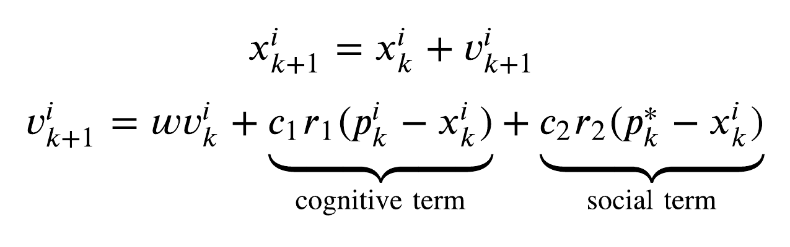
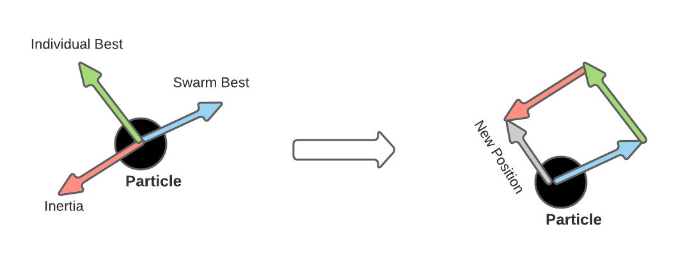
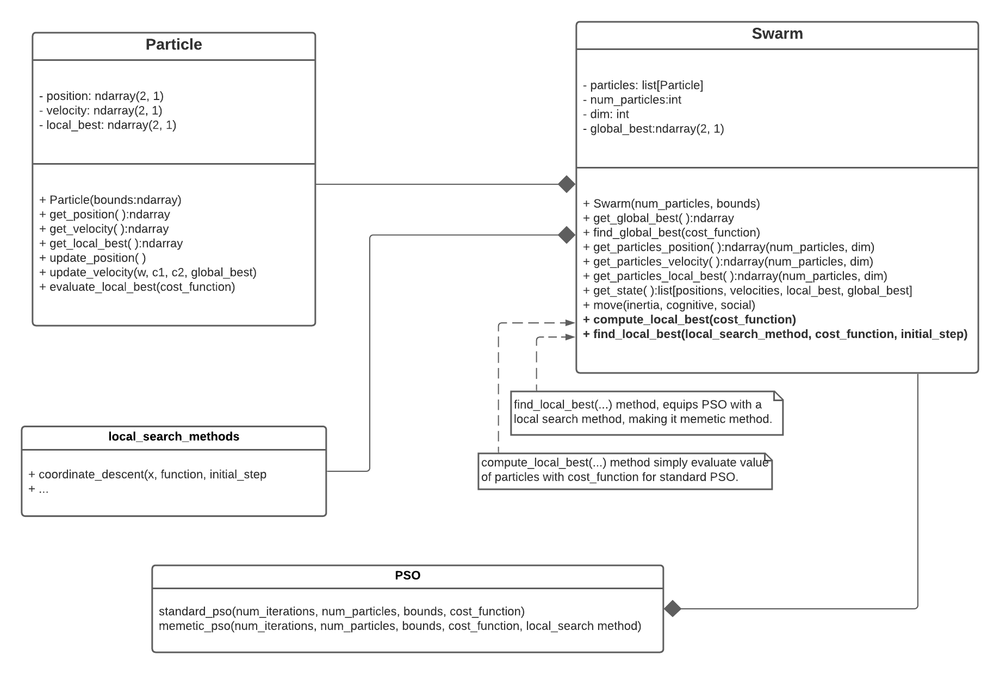

# Particle Swarm Optimization (PSO)
Development of the standard and memetic variant heuristic-algorithm for global optimization.

## Introduction
Particle swarm optimization (PSO) has been successfully applied in many research and application areas. It is demonstrated that PSO can have better results in a faster, cheaper way compared with other methods. It can also be parallelized. Moreover, it does not use the gradient of the problem, in other words, PSO does not require the problem to be differentiable. PSO is a biologically inspired optimization routine designed to mimic birds flocking or fish schooling.

The goal of this project is developer standard and memetic PSO in python and notebook jupyter. Layout directories is follow,
```
├── docker-compose.yaml   # not included
├── Dockerfile    # not included
├── include       # Project main
│   ├── cost_function.py
│   ├── __init__.py
│   ├── local_search_methods.py
│   ├── particle.py
│   └── swarm.py
├── README.md
├── setup.py
└── src         # utility (.png and test function)
    ├── main.py
    ├── PSO.ipynb  # complete report and code
    ├── ...
```
To use this project, just clone the repo and the _include_ folder provides the necessary modules to the _PSO.ipynb_ with report and complete code. If you want to run _PSO.ipynb_ in local mode, you must set a preliminar cell with
```python
import sys
sys.path.append('your_cloned_directory/include')
```

## PSO Theory
For each iteration the swarm moves according to the following two equations,

<p align=center>
  
</p>

The main concept behind [PSO](https://en.wikipedia.org/wiki/Particle_swarm_optimization) is that there is a constant balance between three distinct forces pulling on each particle,
- <b>force of inertia</b> that pushes towards the previous velocity
- <b>cognitive force</b> that pushes towards individual particles' best konwn position
- <b>social force</b> that pushes towards swarm best known position

These three forces are then weighted by w, c1, c2 and randomly perturbed by r1 and r2.

<p align=center>
  
</p>

## Coordinate Descent for Memetic Variant
In computer science and operations research, a memetic algorithm (MA) is an extension of the traditional genetic algorithm. It uses a local search technique to reduce the likelihood of the prematur

This method generates a better initial population and evaluates particle positions for each iteration.e convergence. In this case, we have equipped the PSO algorithm with a local search method to generate individual local best for each particle.

For this study purposal, the [coordinate-descent](https://en.wikipedia.org/wiki/Coordinate_descent) algorithm has been chosen. It is implemented in <i>local_search_method</i> extensible module. The pseudo code is follow,

<p align=center>
  
</p>

## Implementation
<p align=center>
  
</p>

## Results
Tests were executed on the [Ackley Function](https://en.wikipedia.org/wiki/Ackley_function) and we obtain the follow results,
<p align=center>
   
</p>
standard-PSO and memetic-PSO respectively.

## Developing
To develop this project, I used docker service,
```
FROM nvidia/cuda:10.2-cudnn7-devel-ubuntu18.04 as base
ENV PYTHONPATH "${PYTHONPATH}:/src:/include:/plots"
RUN apt-get update && apt-get install -y nano
RUN apt install -y python3-pip && pip3 install numpy
RUN pip3 install jupyter && pip3 install matplotlib
RUN pip3 install imageio
```
with docker-compose,
```
version: '3.7'

services:
  pyGo:
    container_name: 'pyGo'
    build:
      context: .
      dockerfile: ./Dockerfile
    image: base
    volumes:
      - ./src:/src
      - ./plots:/plots
      - ./include:/include

  notebookGo:
    container_name: 'notebookGo'
    build:
      context: .
      dockerfile: ./Dockerfile
    image: base
    volumes:
      - ./src:/src
      - ./plots:/plots
      - ./include:/include
    command: jupyter notebook --port=8888 --no-browser --ip=0.0.0.0 --allow-root
    ports:
      - 8888:8888
    network_mode: 'host'
```
